# XAUUSD EA Backtest Report

Period tested: 2026-01-02 → 2026-02-20  
Initial balance: $100  
Timeframe: M5

---

# EA0 – MTF EMA Pullback (Structured Trend)

## Best Configuration

SL = 1200  
TP = 1800  
MAX_MINUTES = 60  
EARLY_MINUTES = 15  
SL_TO_STOP = 1

## Results

End Balance: $269.90  
Total PnL: +169.90  
Trades: 290  
Winrate: 78.62%  
Max Drawdown: 72.76  
Score: 2.33

  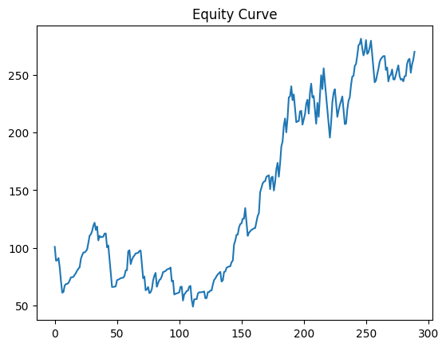
  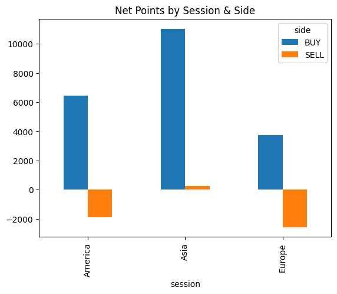
  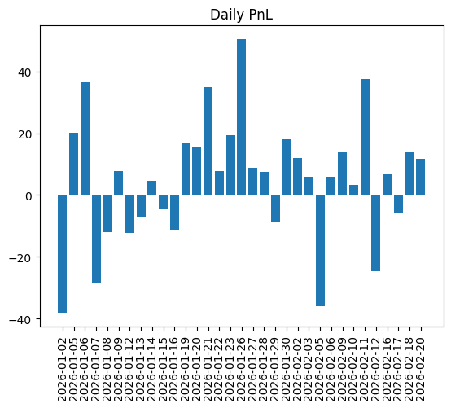

## Notes

- Very high winrate
- Controlled drawdown
- Low growth rate
- Defensive structure system

EA0 is stable but not explosive.

---

# EA1 – MTF Pullback + Momentum Break

## Best Configuration

SL = 1500  
TP = 1500  
MAX_MINUTES = 60  
EARLY_MINUTES = 60  
SL_TO_STOP = 1

## Results

End Balance: $1605.36  
Total PnL: +1505.36  
Trades: 546  
Winrate: 61.54%  
Max Drawdown: 125.74  
Score: 11.97

  
  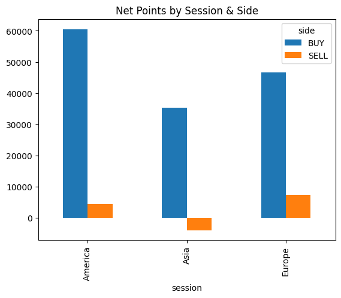
  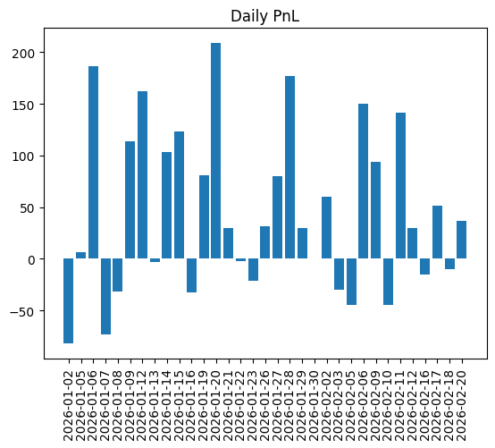

## Without SL Stop

End Balance: $1301.40  
Trades: 1342  
Winrate: 36.58%  
Max DD: 228.53

## Notes

- Performs well only with SL_TO_STOP = 1
- Regime-sensitive
- Overtrades without stop limiter

EA1 needs shutdown logic to survive.

---

# EA2 – Simple Directional Logic

## Best Configuration

SL = 500  
TP = 1800  
MAX_MINUTES = 60  
EARLY_MINUTES = 15  
SL_TO_STOP = 10

## Results

End Balance: $4426.69  
Total PnL: +4326.69  
Trades: 9246  
Winrate: 54.42%  
Max Drawdown: 271.65  
Score: 15.96

  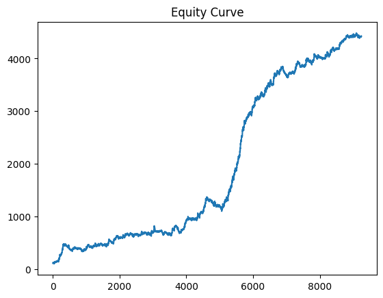
  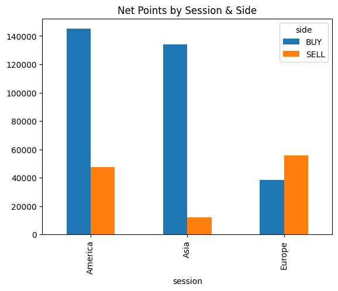
  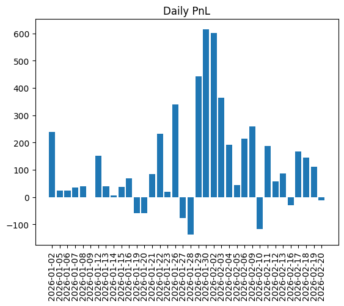

## Notes

- Extremely high trade frequency
- Small edge per trade
- Large exposure
- Likely fragile live (spread/slippage sensitive)

High profit, high structural risk.

---

# EA3 – Structured MTF + Session Stop

## Best Configuration

SL = 1200  
TP = 1500  
MAX_MINUTES = 60  
EARLY_MINUTES = 60  
SL_TO_STOP = 1

## Results

End Balance: $821.06  
Total PnL: +721.06  
Trades: 374  
Winrate: 58.02%  
Max Drawdown: 97.92  
Score: 7.36

  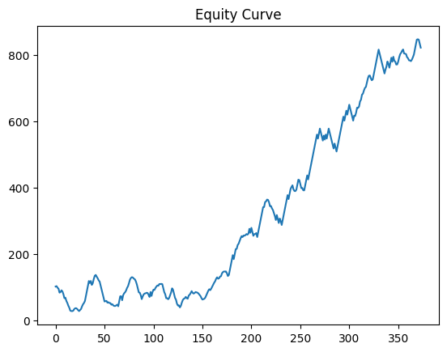
  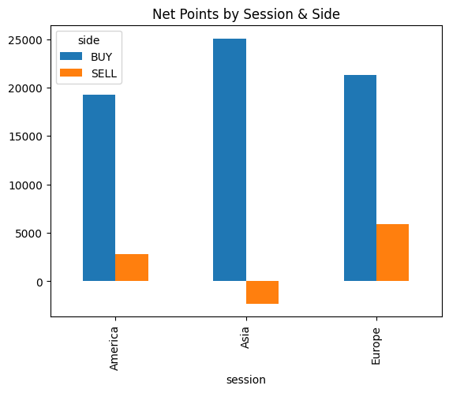
  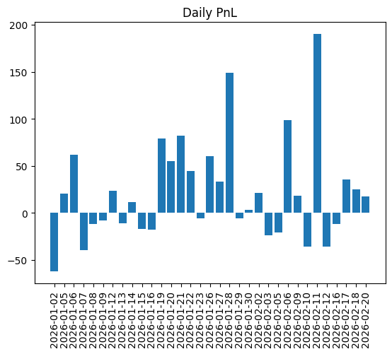

## Notes

- Balanced profile
- Controlled drawdown
- Moderate growth
- Structurally safer than EA1

EA3 is the most stable structured system.

---

# EA4 – EMA200 Momentum Continuation

## Best Configuration

SL = 500  
TP = 1500  
MAX_MINUTES = 60  
EARLY_MINUTES = 60  
SL_TO_STOP = 1

## Results

End Balance: $1158.58  
Total PnL: +1058.58  
Trades: 273  
Winrate: 54.58%  
Max Drawdown: 37.26  
Score: 28.41

  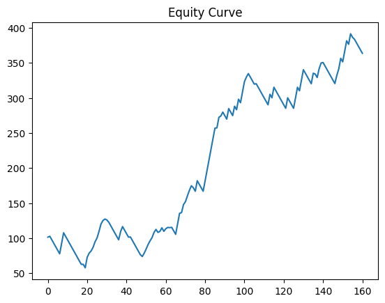
  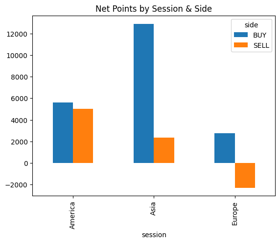
  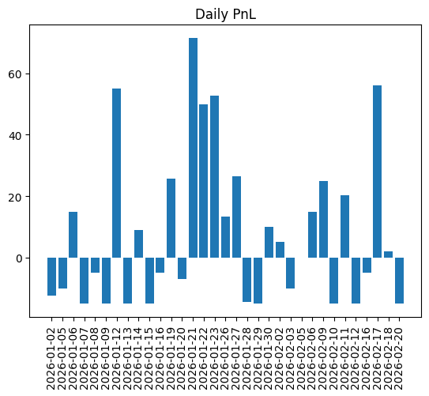

## Notes

- Strong asymmetry
- Very low drawdown
- Clean momentum behavior
- Performs well even with limited trades

EA4 shows highest risk efficiency in this period.

---

# Overall Summary

| EA  | PnL   | MaxDD | Winrate | Trades | Profile                      |
| --- | ----- | ----- | ------- | ------ | ---------------------------- |
| EA0 | +169  | 72    | 78%     | 290    | Defensive                    |
| EA1 | +1505 | 125   | 61%     | 546    | Aggressive, regime-sensitive |
| EA2 | +4326 | 271   | 54%     | 9246   | Overtrading, fragile         |
| EA3 | +721  | 97    | 58%     | 374    | Balanced                     |
| EA4 | +1058 | 37    | 54%     | 273    | Best risk efficiency         |

---

# Conclusion

Primary candidate: **EA4**  
Secondary stabilizer: **EA3**  
Experimental: EA1 (requires strict stop control)  
Defensive baseline: EA0  
High-risk engine: EA2
